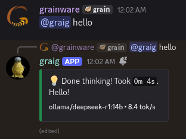

<h1 align="center">
  llmcord+
</h1>

<h3 align="center">
  A full overhaul of llmcord, a Discord bot that allows you to setup LLMs in your Discord server.
</h3>

<p align="center">
  
</p>

> [!IMPORTANT]
> Big thanks to [jakobdylanc](https://github.com/jakobdylanc) for the amazing original llmcord. If you do not need all the features of llmcord+ and want a more minimal bot, check out his repo [here](https://github.com/jakobdylanc/llmcord)!
> This bot is also primarily a side project designed mostly for GrainWare use, so you may have a better experience using the original llmcord.

## Features

### Reply-based chat system

Just @ the bot to start a conversation and reply to continue. Build conversations with reply chains!

You can:

- Branch conversations endlessly
- Continue other people's conversations
- @ the bot while replying to ANY message to include it in the conversation

Additionally:

- When DMing the bot, conversations continue automatically (no reply required). To start a fresh conversation, just @ the bot. You can still reply to continue from anywhere.
- You can branch conversations into [threads](https://support.discord.com/hc/en-us/articles/4403205878423-Threads-FAQ). Just create a thread from any message and @ the bot inside to continue.
- Back-to-back messages from the same user are automatically chained together. Just reply to the latest one and the bot will see all of them.

### Model switching with `/model`


llmcord+ supports remote models from:

- [OpenAI API](https://platform.openai.com/docs/models)
- [Google Gemini API](https://ai.google.dev/gemini-api/docs/models)
- [Mistral API](https://docs.mistral.ai/getting-started/models/models_overview)
- [Groq API](https://console.groq.com/docs/models)
- [OpenRouter API](https://openrouter.ai/models)

Or run local models with:

- [Ollama](https://ollama.com)
- [LM Studio](https://lmstudio.ai)
- [vLLM](https://github.com/vllm-project/vllm)

...Or use any other OpenAI compatible API server.

### And more

- Supports image attachments when using a vision model (like gpt-5, qwen2.5-vl, claude-4, etc.)
- Supports text file attachments (.txt, .py, .c, etc.)
- Customizable personality (aka system prompt)
- User identity aware (OpenAI API only)
- Streamed responses (turns green when complete, automatically splits into separate messages when too long)
- Hot reloading config (you can change settings without restarting the bot)
- Displays helpful warnings when appropriate (like "⚠️ Only using last 25 messages" when the customizable message limit is exceeded)
- Caches message data in a size-managed (no memory leaks) and mutex-protected (no race conditions) global dictionary to maximize efficiency and minimize Discord API calls
- Fully asynchronous
- Modular Python package with clear separation of concerns

### Reasoning progress indicators

The "thinking" header (e.g., "💭 Thinking since…" / "💡 Done thinking!") relies on providers returning hidden reasoning wrapped in `<think>...</think>` tags. This currently works with APIs that emit these tags (for example ollama). Most OpenAI-compatible hosted APIs do not send `<think>` blocks, so the indicator may not appear for those.

If you want to add support, please make a PR.

## Differences from llmcord

This project is a refactor and extension of the original `llmcord`. Major differences:

- Refactored into a clean, modular package (`auth.py`, `messages.py`, `streaming.py`, `reasoning.py`, `discord_utils.py`, `constants.py`, `config.py`) with a script entrypoint (`uv run llmcord`).
- Shows output speed and model name in the footer.
- Reasoning progress header that redacts `<think>` blocks and shows timing when supported (see note above).
- Modern Python codebase with ruff, uv, and basedpyright.

## Instructions

1. Clone the repo:

   ```bash
   git clone https://github.com/GrainWare/llmcord
   ```

2. Create a copy of "config-example.yaml" named "config.yaml" and set it up:

### Discord settings

| Setting | Description |
| --- | --- |
| **bot_token** | Create a new Discord bot at [discord.com/developers/applications](https://discord.com/developers/applications) and generate a token under the "Bot" tab. Also enable "MESSAGE CONTENT INTENT". |
| **client_id** | Found under the "OAuth2" tab of the Discord bot you just made. |
| **status_message** | Set a custom message that displays on the bot's Discord profile.<br /><br />**Max 128 characters.** |
| **max_text** | The maximum amount of text allowed in a single message, including text from file attachments. (Default: `100,000`) |
| **max_images** | The maximum number of image attachments allowed in a single message. (Default: `5`)<br /><br />**Only applicable when using a vision model.** |
| **max_messages** | The maximum number of messages allowed in a reply chain. When exceeded, the oldest messages are dropped. (Default: `25`) |
| **use_plain_responses** | When set to `true` the bot will use plaintext responses instead of embeds. Plaintext responses have a shorter character limit so the bot's messages may split more often. (Default: `false`)<br /><br />**Also disables streamed responses and warning messages.** |
| **allow_dms** | Set to `false` to disable direct message access. (Default: `true`) |
| **permissions** | Configure access permissions for `users`, `roles` and `channels`, each with a list of `allowed_ids` and `blocked_ids`.<br /><br />Control which `users` are admins with `admin_ids`. Admins can change the model with `/model` and DM the bot even if `allow_dms` is `false`.<br /><br />**Leave `allowed_ids` empty to allow ALL in that category.**<br /><br />**Role and channel permissions do not affect DMs.**<br /><br />**You can use [category](https://support.discord.com/hc/en-us/articles/115001580171-Channel-Categories-101) IDs to control channel permissions in groups.** |

### LLM settings

| Setting | Description |
| --- | --- |
| **providers** | Add the LLM providers you want to use, each with a `base_url` and optional `api_key` entry. Popular providers (`openai`, `ollama`, etc.) are already included.<br /><br />**Only supports OpenAI compatible APIs.**<br /><br />**Some providers may need `extra_headers` / `extra_query` / `extra_body` entries for extra HTTP data. See the included `azure-openai` provider for an example.** |
| **models** | Add the models you want to use in `<provider>/<model>: <parameters>` format (examples are included). When you run `/model` these models will show up as autocomplete suggestions.<br /><br />**Refer to each provider's documentation for supported parameters.**<br /><br />**The first model in your `models` list will be the default model at startup.**<br /><br />**Some vision models may need `:vision` added to the end of their name to enable image support.** |
| **system_prompt** | Write anything you want to customize the bot's behavior!<br /><br />**Leave blank for no system prompt.**<br /><br />**You can use the `{date}` and `{time}` tags in your system prompt to insert the current date and time, based on your host computer's time zone.** |

3. Install the dependencies:

  > [!IMPORTANT]
  > Before installing the dependencies, make sure you have `uv` installed. See [here](https://docs.astral.sh/uv/getting-started/installation/) for instructions.

   ```bash
   uv sync
   ```

4. Run the bot:

   No Docker:

   ```bash
   uv run llmcord
   ```

   With Docker:

   ```bash
   docker compose up --build
   ```
